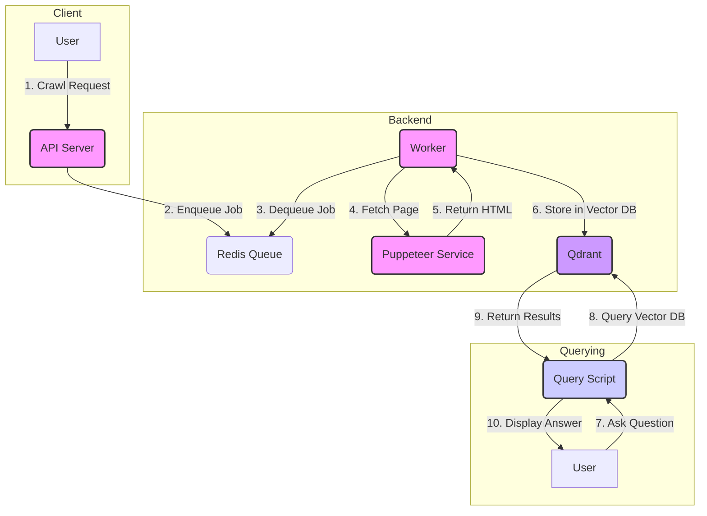

# 処理フロー解説

了解しました。このプロジェクトの処理フローを解説します。

### 処理フローの概要

このプロジェクトは、指定されたURLのウェブページをクロールし、その内容をベクトル化してベクトルデータベース（Qdrant）に保存するシステムです。保存されたデータを用いて、質問応答などが可能です。

全体像は以下のようになります。



### 各ステップの詳細

1.  **クロールリクエスト (Crawl Request)**
    *   ユーザーは `apps/api` (APIサーバー)に対して、クロールしたいURLを指定してリクエストを送信します。
    *   APIサーバーはリクエストを受け取り、ジョブIDをユーザーに返します。

2.  **ジョブのエンキュー (Enqueue Job)**
    *   APIサーバーは、受け取ったクロールリクエストをジョブとしてRedisのキューに追加します。

3.  **ジョブのデキュー (Dequeue Job)**
    *   `apps/worker` (バックグラウンドで動作するワーカー)がRedisのキューを監視しており、新しいジョブをデキューします。

4.  **ページの取得 (Fetch Page)**
    *   ワーカーは、ジョブに含まれるURLを `apps/puppeteer-service` に渡して、そのページのHTMLコンテンツを取得します。`puppeteer-service` はヘッドレスブラウザ(Puppeteer)を使ってJavaScriptでレンダリングされた後のHTMLを取得します。

5.  **HTMLの返却 (Return HTML)**
    *   `puppeteer-service` は取得したHTMLコンテンツをワーカーに返します。

6.  **ベクトルDBへの保存 (Store in Vector DB)**
    *   ワーカーは受け取ったHTMLから本文を抽出し、テキストをチャンクに分割します。
    *   各チャンクをベクトル化（Embedding）し、そのベクトルとテキストデータをベクトルデータベースであるQdrantに保存します。

7.  **質問応答 (Querying)**
    *   ユーザーは `scripts/ask.py` などのスクリプトを使って質問をします。
    *   スクリプトは質問文をベクトル化します。
    *   Qdrantにクエリを投げ、質問ベクトルと類似度の高いテキストチャンクを取得します。
    *   取得したテキストチャンクを元に、LLM（大規模言語モデル）が回答を生成し、ユーザーに提示します。

### 使用されている主な技術

*   **API Server (`apps/api`)**: Node.js (Hono) で実装されたAPIサーバー。クロールリクエストを受け付け、ジョブをキューに追加します。
*   **Worker (`apps/worker`)**: Node.js (BullMQ) で実装されたワーカー。キューからジョブを取り出し、Puppeteer Serviceを使ってウェブページを取得・処理します。
*   **Puppeteer Service (`apps/puppeteer-service`)**: Node.js (Express) で実装されたサービス。ヘッドレスブラウザ(Puppeteer)を操作して、指定されたURLのHTMLコンテンツを取得します。
*   **Vector Database (`qdrant`)**: ベクトル化されたデータを保存・検索するためのデータベースです。
*   **Queue (`redis`)**: ジョブキューとしてRedisが使用されています。
*   **Glob**: ファイルパスのパターンマッチングに使われます。
*   **TypeScript**: 静的型付けのためにプロジェクト全体で使われています。

### ディレクトリ構成

```
/
├── apps/
│   ├── api/              # APIサーバー (Hono)
│   └── puppeteer-service/ # Puppeteerを使ったスクレイピングサービス (Express)
├── packages/
│   ├── core/             # 共通の型定義など
│   └── workers/          # キューを処理するワーカー (BullMQ)
└── scripts/
    ├── glob/             # ファイル検索用のスクリプト
    └── ...
```

この構成により、各コンポーネントが独立して開発・デプロイ可能となっており、スケーラビリティとメンテナンス性が高められています。
